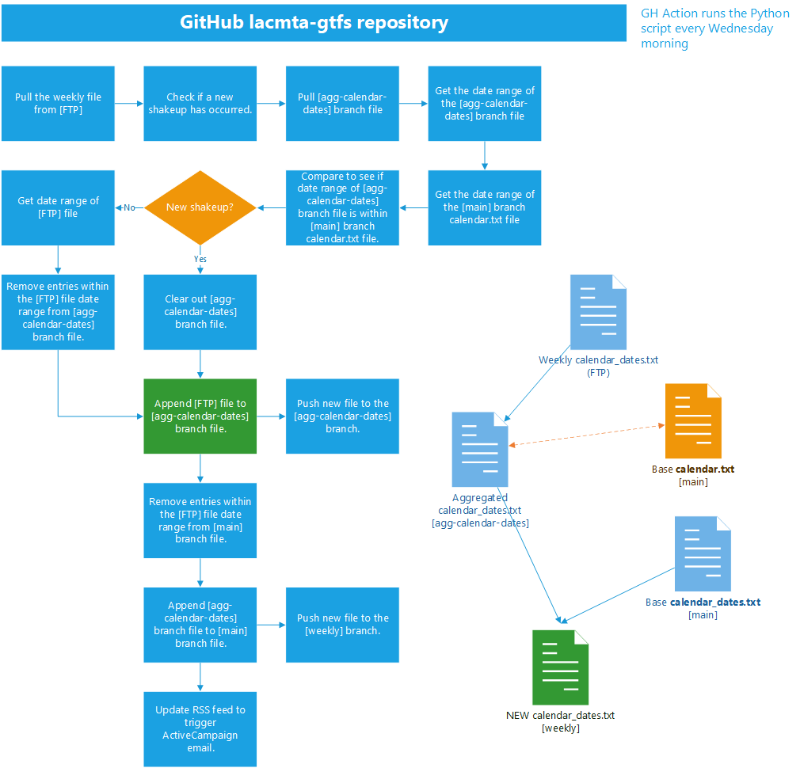

# Workflow

## Schedule

`update_gtfs.py` is automatically run on a weekly basis, Wednesdays at 11am UTC/3am PTC (via `.github/workflows/python-publish.yml`).

## Components

### `gtfs_bus`

The `gtfs_bus` repository is hosted [on GitLab](https://gitlab.com/LACMTA/gtfs_bus) and contains Metro's official GTFS for bus service.

Branches:

- `master` - This branch reflects currently active service.  We avoid making changes to this branch as much as possible because this represents the "base" service defined at the start of the shakeup.
- `future-service` - Future service.  An updated GTFS will be pushed to this branch roughly 1-2 weeks before a new shakeup goes into effect.  This branch does not contain current service merged with future service; the service dates in this branch will not overlap with the `master` branch.  This branch will be merged into the `master` branch the night before the new service goes into effect.  At that point, this branch will effectively reflect "current" service until the GTFS files for the next shakeup become available.
- `weekly-updated-service` - This branch will be updated weekly and will contain the accumulation of weekly updates to the `master` branch following the most recent shakeup.  Updates will include the integration of a weekly generated `calendar_dates.txt` file that updates service for the two following weeks, as well as the addition of temporary express bus service (such as the Dodger Stadium Express and the SoFi Stadium Express).

## Behavior

Diagram for the automation running in this repository:

1. Compare the `[weekly-updated-service] calendar.txt` file to the `[master] calendar.txt` file to determine if a shakeup has occured within the past week.
    1. If a shakeup has occured, use the `[master] calendar_dates.txt` as our `starting calendar_dates.txt`. Remove all content from the `[master] calendar_dates/` folder.
    2. If no shakeup has occured, use the `[weekly-updated-service] calendar_dates.txt` as our `starting calendar_dates.txt`.
2. Remove entries from the `starting calendar_dates.txt` that fall within the `current date range`.
3. Get the `[FTP] calendar_dates.txt` file and determine the `current date range`.
4. Add the `[FTP] calendar_dates.txt` file to the `[master] calendar_dates/` folder using the format `yy-mm-dd/calendar_dates.txt` and also add it to the `starting calendar_dates.txt`.
5. Extract the entries from `[lacmta-gtfs] dse-sofi-express.csv` that fall in the `current date range` and add it to the `starting calendar_dates.txt`.
6. Generate a new zip file of the `[weekly-updated-service]` branch, commit, and push all the changes to GitLab.
7. Update the RSS feed to trigger an automated ActiveCampaign email.

